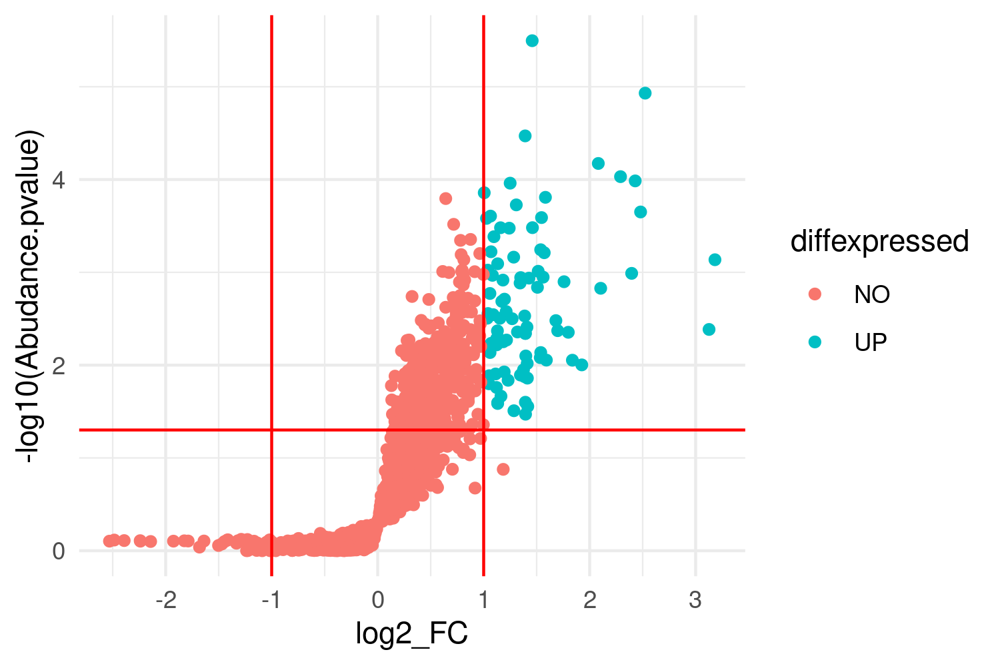
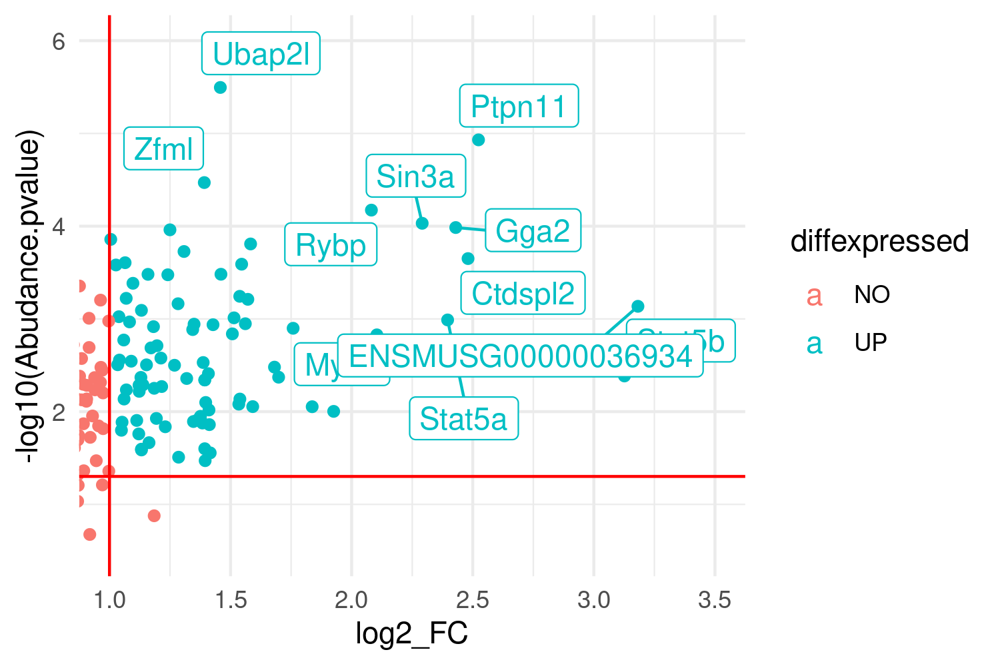
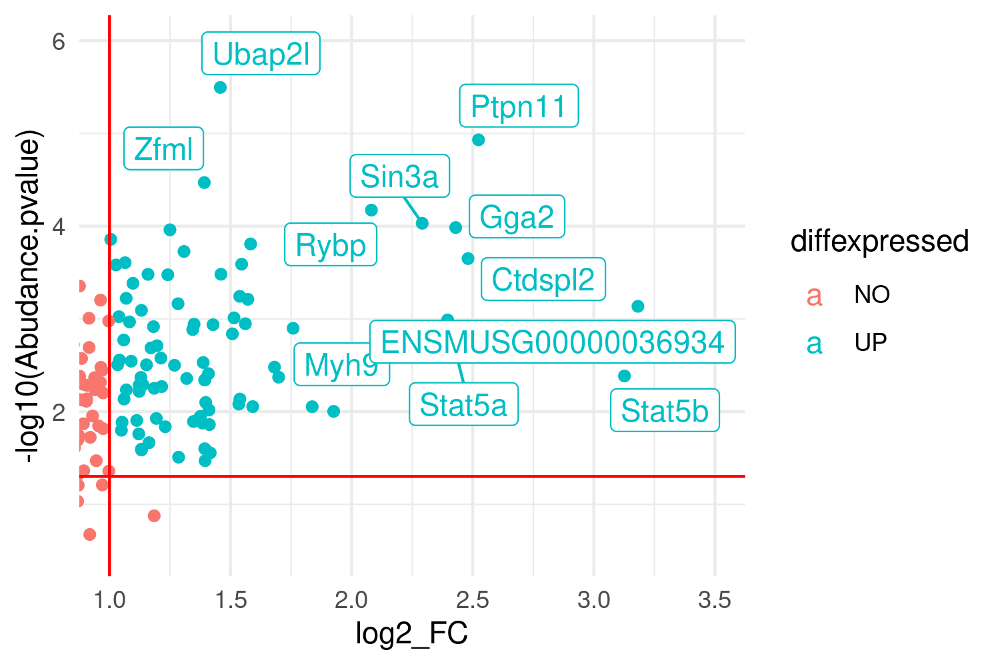
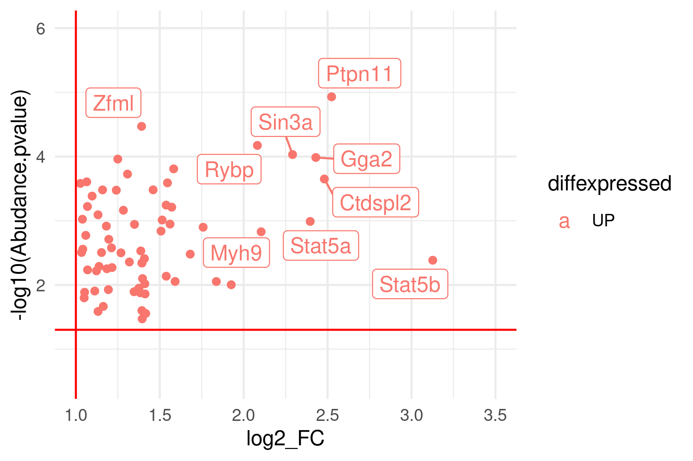

------------------------------------------------------------------------

#### Introduction

-   The research question can be summarized as: "Disentangle mechanisms of cellular differentiation between regular stem cells and pluripotent stem cells in mice"
-   The approach used is proteomics based on MS data that was generated in two different batches. The datasets are generated by inducing differentiation with horse-serum on non-differentiated muscle mouse cells (C2C12 cells) as control and blocking the differentiation by LIF in treated sample. Proteome data set contains three control samples and three LIF treated samples per identified protein. The Phospho data set contains the same amount of samples from both groups, but these were enriched for phosphorylation. This is a follow up experiment, since the first experiment containing only the Proteome data set showed no significant increase from any protein and the new hypothesis is based on post-translational phosphorylation as signal.

------------------------------------------------------------------------

#### Download raw data from Uppmax

```{bash}
#rsync -r noahe@rackham.uppmax.uu.se:/proj/g2020004/private/student_projects/phosphoproteomics /home/noah/phosphoproteomics_project/
```

------------------------------------------------------------------------

#### Setting working directory and install libraries

```{r message=FALSE, warning=FALSE, results='hide'}
setwd("~/phosphoproteomics_project")
RequiredPackages <- c("BiocManager", "dplyr", "igraph", "tidyr","ggplot2","ggrepel") 
#Installs packages if not yet installed
for (i in RequiredPackages) { 
    if (!require(i, character.only = TRUE)) 
    install.packages(i)
}
BiocManager::install(version = "3.15")
library(BiocManager)
BiocManager::install("STRINGdb")
library(tidyr)
library(dplyr)
library(igraph)
library(STRINGdb)
library(ggplot2)
library(ggrepel)
remove(RequiredPackages)
```

------------------------------------------------------------------------

#### Load raw data

-   Change default separator to ";"

```{r}
raw_data_phospho <- read.csv(file = "~/phosphoproteomics_project/phosphoproteomics/Dataset_Phospho.csv", sep = ";")
raw_data_proteom <- read.csv(file = "~/phosphoproteomics_project/phosphoproteomics/Dataset_Proteome.csv", sep = ";")
```

------------------------------------------------------------------------

#### If loop to omit na.value from all Abundance columns

-   grep line selects all columns that contain the string "Abundance" and saves the column number in *Abundance_columns*
-   The for loop then selects all row were there is *no* NA value in one of the Abundance columns and copies them to data_phospho to leave the raw data untouched.
-   **!(is.na(raw_data_phospho[,i]))** gives out all the rows that don't have an NA value, these get selected

```{r}
Abundance_columns <- grep("Abundance", colnames(raw_data_phospho) )
for (i in Abundance_columns) {
  data_phospho <- raw_data_phospho[!(is.na(raw_data_phospho[,i])), ]
  }
```

------------------------------------------------------------------------

#### Calculate Mean for Abundance and adding it as column and Ratio LIF/Control

-   grep again Abundance but this time the Control and LIF (case) separately.
-   calculate row means each and the ration between the means.

```{r}
Abundance_columns <- grep("Abundance.Control", colnames(data_phospho))
data_phospho$Abudance.Mean.Control <- rowMeans(data_phospho[,c(Abundance_columns)])
Abundance_columns <- grep("Abundance.LIF", colnames(data_phospho))
data_phospho$Abudance.Mean.LIF <- rowMeans(data_phospho[,c(Abundance_columns)])
data_phospho$Abudance.Ratio <- data_phospho$Abudance.Mean.LIF / data_phospho$Abudance.Mean.Control
remove(Abundance_columns, i)
```

------------------------------------------------------------------------

#### Calculate p-values

-   *t.test* to compare all 3 Control \<-\> 3 Case values. If they are different then the pvalue \< 0.05 **-\>** indicating a real differences between case & control. If p-value is big the difference is by chance😄 I tried it for row 188 which has a Ration nearly equal to 1 (1.02...) indicating no difference in case vs. control and the p value \~ 0.7 (really bad) also indicating no difference. The for loop iterates it over all rows, Alices quicker approach uses the apply function that allows parallel iteration making it quicker.

```{r warning=FALSE}
start_for <- Sys.time()
for (row in 1:nrow(data_phospho)) {
  p_value <- t.test(data_phospho[row,10:12], data_phospho[row,13:15], alternative = "less") 
  #tests if mean of control is different from mean of LIF (case) and assigns it to list p_value
  data_phospho$Abudance.pvalue[row] <- p_value$p.value 
  #selects p.value from list and assigns it to new column"Abudance.pvalue" in the correct row
  }
end_for <- Sys.time()
end_for - start_for #We wanted to compare calculation time to compare the methods
#Alice quicker approach
df_copy <- dplyr::tibble(data_phospho) # Copy df
start_alice <- Sys.time()
df_copy[] <- lapply(df_copy, function(x) as.numeric(as.character(x)))
df_copy$pValues <- apply(df_copy, 1, function(x) t.test(x[10:12],x[13:15], alternative = "less", paired = F)$p.value)
end_alice <- Sys.time()
end_alice-start_alice #Proves that apply is x4 faster then loop
remove(end_alice,end_for,start_alice,start_for,row,p_value, df_copy)
```

------------------------------------------------------------------------

#### Adding a Volcano plot to explore the initial data

-   The main idea is to identify thresholds that can be used to clean the raw data.

```{r message=FALSE, warning=FALSE}
### Phospho volcano plot
string_db_volcano <- STRINGdb$new( version="11.5", species=10090, score_threshold=1, input_directory="")
# This had to be outside the volcano_phospho_plot function, because the function didnt return the string_db_volcano function that is needed also afterwards.
# Defining function to plot data
    # Makes the whole code easy to reuse.
volcano_phospho_plot <- function(phospho, number){
# Calculate LIF/Control ratio
phospho$FC <- phospho$Abudance.Mean.LIF / phospho$Abudance.Mean.Control
phospho$log2_FC <- log2(phospho$FC)
phospho$diffexpressed <- "NO"
phospho$diffexpressed[phospho$log2_FC > 1 & phospho$Abudance.pvalue < 0.05] <- "UP" # sorts out upregulated phospo values and assigns "UP" value.
phospho$diffexpressed[phospho$log2_FC < -1 & phospho$Abudance.pvalue < 0.05] <- "DOWN" # same or downregulated phospho values
phospho$delabel <- NA
phospho$delabel[phospho$diffexpressed != "NO"] <- phospho$Master.Protein.Accessions[phospho$diffexpressed != "NO"] # selecting only up or down regulated values and assigning them to the label column.
##Addition to generate "real names" not Uniprot IDs
Mapping_phospho <- string_db_volcano$map(phospho, "delabel", removeUnmappedRows = F)
Mapping_phospho <- string_db_volcano$add_proteins_description(Mapping_phospho) #Add´s protein information to STRINGid´s = preferred names are more human readable
#Volcano plot overview
ggplot(data=Mapping_phospho, aes(x=log2_FC, y=-log10(Abudance.pvalue), col=diffexpressed, label=preferred_name))+
  geom_point()+
  theme_minimal()+
  geom_vline(xintercept=c(-1, 1), col="red") +
  geom_hline(yintercept=-log10(0.05), col="red")
#saves the correct photo for both possible input tables
# number 1 or 2 has to be defined in the function input data. This is a bit clumsy solved, but there were problems with returning more than one plot out of a function.
if (number == 1) {
  ggsave("~/phosphoproteomics_project/results/Zoomed_out_Volcano.png", width = 1500, height = 1000, units = "px") # Saves plots with defined size
}
if (number == 2) {
  ggsave("~/phosphoproteomics_project/results/Zoomed_out_Volcano_for_more_phosphrylated_after_qc_and_filter.png", width = 1500, height = 1000, units = "px")
}
#Detail/Zoomed in
ggplot(data=Mapping_phospho, aes(x=log2_FC, y=-log10(Abudance.pvalue), col=diffexpressed, label=preferred_name))+
  geom_point()+
  theme_minimal()+
  geom_vline(xintercept=c(-1, 1), col="red") +
  geom_hline(yintercept=-log10(0.05), col="red") + 
  coord_cartesian(xlim = c(1,3.5), ylim = c(0.5, 6))+
  geom_label_repel()
#saves the correct photo for both possible input tables
if (number == 1) {
  ggsave("~/phosphoproteomics_project/results/Zoomed_in_Volcano.png", width = 1500, height = 1000, units = "px")
}
if (number == 2) {
ggsave("~/phosphoproteomics_project/results/Zoomed_in_Volcano_for_more_phosphrylated_after_qc_and_filter.png", width = 1500, height = 1000, units = "px")
}
}
volcano_phospho_plot(data_phospho, 1) #plots data to control
```





------------------------------------------------------------------------

#### Proteome volcano plot

-   Also plotting the proteome data to identify thresholds to clean data

```{r}
# Defining function first
volcano_plot_proteome <- function(proteome){
proteome$log2_FC <- log2(proteome$Abundance.Ratio...LIF.....Control.)
proteome$diffexpressed <- "NO"
proteome$diffexpressed[proteome$log2_FC > 1 & proteome$Abundance.Ratio.P.Value...LIF.....Control. < 0.05] <- "UP"
proteome$diffexpressed[proteome$log2_FC < -1 & proteome$Abundance.Ratio.P.Value...LIF.....Control. < 0.05] <- "DOWN"
ggplot(data=proteome, aes(x=log2_FC, y=-log10(Abundance.Ratio.P.Value...LIF.....Control.), col=diffexpressed))+
  geom_point()+
  theme_minimal()+
  geom_vline(xintercept=c(-1, 1), col="red") +
  geom_hline(yintercept=-log10(0.05), col="red")
}
#Printing the volcano plot
volcano_plot_proteome(raw_data_proteom) # Plots all the data 
```

-   No values are significantly up or down regulated (defining up / down regulated as at least 2-fold increase/decrease). Also outliers could be observed (4 vales with a \>2-fold increase with non-significant p-values). To be more restrictive and decrease the change of false positives in the upcoming analysis, also significantly increased values with a ratio \> 1 were selected as undesired data and are going to be removed in the following cleaning steps.

------------------------------------------------------------------------

#### Subsetting data_phospho for ratio values \>= 2 and p-values \<= 0.05

-   

    a.  Remove peptides without quantitative values -\> Already done in "If loop to omit na.value from all Abundance columns" thereby creating the data_phospho

-   Here we use the identified thresholds from the volcano plots to clean the data. First we select rows with ratio \>= 2 and p.values \<= 0.05 from the phopho dataset. From the proteom data set values were selected with a all rows with a ratio \<= 1, all rows with a ratio \>= 1 and p.value \<= 0.05 (elevated proteins (ratio \>=1) with significant p-values are excluded and protein with ratios bigger than 2 (disregarding p-value), too). After this initial cleanup a semi_join() was performed returning all rows from cleanup phospho with a match in cleanup proteome, to select only phospo values that showed increased phosphorylation due to the LIF treatment and not due to elevated expression levels.

-   volcano plots were used to visualize the cleaning/selecting steps

```{r message=FALSE, warning=FALSE}
##Filter NA out in proteome, Filter out p.values that are non significant(not adjusted)
  #securing no overwrite to original data
df_phospho = data_phospho
df_proteome = raw_data_proteom
  
## Filter PHOSPHO
  more_phospho <- subset.data.frame(df_phospho, subset = df_phospho$Abudance.Ratio >= 2) #Filters out all ratios below 2-fold
  more_phospho <- subset.data.frame(more_phospho, subset = more_phospho$Abudance.pvalue <= 0.05) #Filters out all non-significant p-values
  
  ##Filter PROTEOME
  exclude_proteome <- filter(df_proteome, df_proteome$Abundance.Ratio.P.Value...LIF.....Control. <= 0.05 & df_proteome$Abundance.Ratio...LIF.....Control. >= 1) #Filters out all significant p-values, because significant p-values indicate an 
  #Data that we want to exclude, testing if the right data is selected with the volcano plot
  volcano_plot_proteome(exclude_proteome)
  #Anti_join anti_join() return all rows from x without a match in y. 
  more_proteome <- anti_join(df_proteome, exclude_proteome, by = c("Accession" = "Accession"))
  more_proteome <- filter(more_proteome, more_proteome$Abundance.Ratio...LIF.....Control. <= 2) # removes outliers with ratio bigger then 2
  #Checking the if the right data is excluded
  volcano_plot_proteome(more_proteome)
  
  #Inner join works too, but semi join is better becasue the proteome columns are not included into the resulting data frame.
  #more_phosphorylated <- dplyr::inner_join( more_phospho, more_proteome, by = c("Master.Protein.Accessions" = "Accession"))
  
  #Semi-join #semi_join() return all rows from x with a match in y. 
  more_phosphorylated <- dplyr::semi_join(more_phospho, more_proteome, by = c("Master.Protein.Accessions" = "Accession"))
  volcano_phospho_plot(more_phosphorylated, 2) # to control remaining data
  
remove(df_phospho, df_proteome, more_phospho, more_proteome, exclude_proteome)
```

------------------------------------------------------------------------

#### Comparing data before and after the cleanup

-we could identify that the cleanup was conducted and not too stringent returning enough data to conduct analyisis on.

------------------------------------------------------------------------

#### {width="350"}{width="350"}

------------------------------------------------------------------------

#### 

#### Building network map of the proteins

-   With help of the STRINgdb package the overview networks were produced with different thresholds.

```{r}
##Lower score_threshold, allowing more connections
string_db_low <- STRINGdb$new(version="11.5", species=10090, score_threshold=1, input_directory="") #species = mouse identifier, score threshold = if one interaction this will be mapped, no input directory data stored only temporary
hits_low <- string_db_low$map(more_phosphorylated, "Master.Protein.Accessions", removeUnmappedRows = F) #mapping the UNIPROT Ids from the first column to get STRING identifiers
string_db_low$plot_network(hits_low$STRING_id) #plotting network
invisible(string_db_low$get_png(hits_low$STRING_id, file = "~/phosphoproteomics_project/results/Network_low.png")) #Saving photo
## Higher score_threshold, allowing less connections
string_db_high <- STRINGdb$new(version="11.5", species=10090, score_threshold=200, input_directory="") #species = mouse identifier, score threshold = if one interaction this will be mapped, no input directory data stored only temporary
hits_high <- string_db_high$map(more_phosphorylated, "Master.Protein.Accessions", removeUnmappedRows = F) #mapping the UNIPROT Ids from the first column to get STRING identifiers
string_db_high$plot_network(hits_high$STRING_id) #plotting network
invisible(string_db_high$get_png(hits_high$STRING_id, file = "~/phosphoproteomics_project/results/Network_high.png")) #Saving photo
```

------------------------------------------------------------------------

#### Way to identify the Proteins Stat5b is connected to.

-   In this chunk we define a function with a more and a less stringent threshold to get 1. Proteins_connected_to_Stat5b for more or less stringent threshold, 2. Network plot for the subnetworks of proteins connected to Stat5b, 3. Link to webpage for the subnetworks, 4. Pathways that are enriched in the subnetworks.

-   There is also a link to the [STRINGdb website for less stringent threshold = 1](https://version-11-5.string-db.org/cgi/link?to=2E8CDC990DBD10F7) with the Proteins connected to Stat5b in this dataset.

-   There is also a link to the [STRINGdb website for more stringent threshold = 200](https://version-11-5.string-db.org/cgi/link?to=18B5C3E16E9B3AE0) with the Proteins connected to Stat5b in this dataset.

```{r}
#Finding String id identifier for Stat5b and assigning it to the a variable
i <- grep("P42232", hits_low$Master.Protein.Accessions) 
Stat5b <- string_db_low$mp("P42232") #mapping the UNIPROT Ids 
## Mapping Stat5b interactions in the less stringent data set and more stringent data set
#Defining a function to get 1. Proteins_connected_to_Stat5b, 2. Network plot, 3. Link to webpage, 4. Pathways
subnetworks <- function(data_h,score_h) {
  #a = The data we want to have a network from, b = the threshold number of the string_db function
  string_db <- STRINGdb$new(version="11.5", species=10090, score_threshold = score_h, input_directory="") #species = mouse 
  get <- string_db$get_subnetwork(data_h) #builds subnetwork from every entry in STRING_id
  ghi <- get[[Stat5b]][1] ##gives the list entry of "get" that lists all 18 entries that interact with Stat5b
  hg <- unique(ghi$`10090.ENSMUSP00000102981`) #gives the unique interaction (9 out of 18), 
  mat <- as_ids(ghi$`10090.ENSMUSP00000102981`) #function as_ids from the igraph package reads the class("igraph.vs")   and collapses it into a matrix
  Proteins_connected_to_Stat5b <- as.data.frame(unique(mat))
  names(Proteins_connected_to_Stat5b)[1] <- "STRING_id" #Renaming column so that add_protein_description recognizes it
  Proteins_connected_to_Stat5b[(nrow(Proteins_connected_to_Stat5b)+1),] <- Stat5b #Adds Stat5b to map its connections
  Proteins_connected_to_Stat5b <- string_db$add_proteins_description(Proteins_connected_to_Stat5b) #Add´s protein information to STRINGid´s
  
  #Plotting the subnetwork
  string_db$plot_network(Proteins_connected_to_Stat5b$STRING_id)
  
  #providing my link
  link <- string_db$get_link(Proteins_connected_to_Stat5b$STRING_id) #Provides link to the STRINGdb page
  
  #Providing the pathways
  pathways <- string_db$get_enrichment(Proteins_connected_to_Stat5b, category = "KEGG")
  return(list(Proteins_connected_to_Stat5b, pathways, link))
  
  remove(get,ghi,hg,mat)
   }
## Less stringent parameter to determine the Proteins that interact with Stat5
subnetwork_less_stringent <- subnetworks(data_h = hits_low$STRING_id, score_h = 1) #Using function
#Sub-setting the returned list into original dataframes + link
Proteins_connected_to_Stat5b_less <- subnetwork_less_stringent[[1]]
pathways_less <- subnetwork_less_stringent[[2]]
Link_less <- subnetwork_less_stringent[[3]]
Link_less #Link to website
invisible(string_db_low$get_png(Proteins_connected_to_Stat5b_less$STRING_id, file = "~/phosphoproteomics_project/results/Network_Stat5_less.png")) #Saving png
## More stringent parameter to determine the Proteins that interact with Stat5
subnetwork_more_stringent <- subnetworks(data_h = hits_high$STRING_id, score_h = 200) #Using function
#Sub-setting the returned list into original dataframes + link
Proteins_connected_to_Stat5b_more <- subnetwork_more_stringent[[1]] 
pathways_more <- subnetwork_more_stringent[[2]]
Link_more <- subnetwork_more_stringent[[3]]
Link_more #Link to website 
invisible(string_db_high$get_png(Proteins_connected_to_Stat5b_more$STRING_id, file = "~/phosphoproteomics_project/results/Network_Stat5_more.png")) #Saving png
```

------------------------------------------------------------------------

#### Printing Pathways

-printing the enriched pathways from the subnetworks of Stat5b and renaming them for a better human readability & formatting of html document.

```{r paged.print=TRUE}
#Identifying only for Proteins connected to Stat5b
#Function to generate tabels based on factor gene counts / number of annotated genes.
factor_function <- function(Pathway){
i = 1
for (i in i:nrow(Pathway)) {
  Pathway$factor[i] <- round((Pathway[i,3]/Pathway[i,4]), digits = 3) #rounded for better visualization
}
Pathway <- rename(Pathway, background = number_of_genes_in_background)
Pathway <- rename(Pathway, hits = number_of_genes)
Pathway <- rename(Pathway, involved_genes = preferredNames)
Pathway <- Pathway[order(Pathway$factor,decreasing = T ),]
return(print.data.frame(Pathway[1:5,c(11,3,4,10,7)], row.names = F))
}
#Table for less stringent parameters
factor_function(pathways_less)
#Table for more stringent parameters
factor_function(pathways_more)
## This part does not work with STRINGdb version 11.5, it worked properly with version 11.0b
#Identifying pathways also for Proteins with a ratio >=2 and p.value <= 0.05 and threshold = 200.
#Big_network_pathways_more <- string_db_high$get_enrichment(hits_high$STRING_id, category = "KEGG")
#factor_function(Big_network_pathways_more)
#Identifying pathways also for Proteins with a ratio >=2 and p.value <= 0.05 and threshold = 1.
#Big_network_pathways_less <- string_db_low$get_enrichment(hits_low$STRING_id, category = "KEGG")
#factor_function(Big_network_pathways_less)
remove(i, Link_less, Link_more, string_db_high, string_db_low, subnetworks, volcano_plot_proteome, subnetwork_less_stringent, subnetwork_more_stringent, hits_high, hits_low, data_phospho, factor_function, volcano_phospho_plot, string_db_volcano)
```

------------------------------------------------------------------------

#### Results and Discussion

-   Stat5b was picked as the lead target since it showed the highest significant ratio after data clean up in the phospho data set.

-   The more stringent parameters turned out less proteins connected to Stat5b/5a but with a higher security of true association. The generated subnetwork for Stat5b showed a very promising target for further investigation, since a network evolved around Stat5b. Generated pathways to investigate the effect of increased phosphorylation returned many cancer-related pathways indicating a connection between retaining a non-differentiated state in stem cells and the capability of cancerous cells to form cancerous masses. Of the non-cancer pathways JAK-STAT is of most importance since it's also the sub pathway affected in the cancer pathways.

    .](images/jak-stat_pathway.png)

-   The less stringent parameters turned out more proteins connected to Stat5b/5a but has a higher risk of false positive connections. The most important involved genes were Stat5a/b. Stat5b forms homo- and hetero dimers with the paralog Stat5a. Upon Tyr-phosphorylation they dimerize and translocation into the nucleus takes place, where it acts as [transcription factor](https://doi.org/10.1074/jbc.274.32.22484). The more stringent threshold parameter removed Sos1 from the dataset. Sos1 is involved together with Stat5a/b in most of the enriched pathways in the less stringent dataset. The (Ras-Raf-) MAPK pathway is partly regulated by Sos1, normally acting as guanin nucleotide exchange factor [upon Ras](https://doi.org/10.1083/jcb.200103146). Phosphorylation of specific Serin residues have a deactivating effect on Sos1 and it acts as negative regulator on the [whole MAPK pathway](https://doi.org/10.1042/BJ20120938), a pathway normally associated with [promoting differentiation](https://doi.org/10.1002/jcp.28334). Sos1 is also involved in the mTOR pathway, together with Akt1s1 (subunit of mTORC1), both are found in the less stringent sub network but not the more stringent one.

    .](images/mTOR_pathway.png)

-   Under these biological circumstances these findings can be counted as valid and are objects for further investigations, while other hits in the less stringent data set may be found as false positives. This was a very good example of the trade-of encountered by threshold settings that must be controlled thorough the data analysis.

#### Conclusion

-   Many cancers involved pathways are also activated to ensure stemness in non-differentiated muscle mouse cells upon differentiation stimuli.
-   Major targets for further investigations are JAK-STAT pathway proteins and Sos1 and Akt1s1 with the mTOR- and MAPK-pathway. Especially identification of phosphorylation sites in the protein and experiments with different differentiation inhibitors to ensure unspecific activation of stemness protecting pathways or identification of alternatively activated pathways could provide more insights.
-   Also, possibly a reproduction of the dataset containing more samples to identify with a higher security the elevation of involved proteins and also reproduction in different cell lines to ensure that the observed effects are stemness related and not cell line related would be interesting research targets. Since the bioinformatic pipeline is in place, the analysis could be conducted quickly.

#### Reproducibility
-   This project has a GitHub repository and the Rnotebook is written so that it can be executed with the downloaded repository.

------------------------------------------------------------------------

------------------------------------------------------------------------
